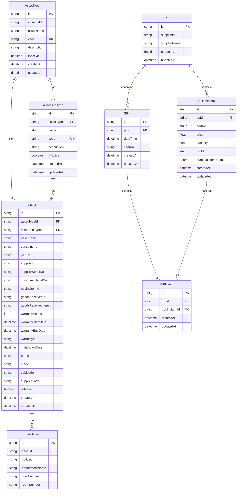

# Asset Management Database Schema

## Entity Relationship Diagram

## Database Schema Overview

### Core Asset Management
- **AssetType**: Defines categories of assets with industry classification
- **AssetSubType**: Subcategories within asset types
- **Asset**: Individual asset records with detailed information
- **Installation**: Location and installation details for assets

### Purchase Management
- **PO**: Purchase orders with supplier information
- **POLineItem**: Individual line items within purchase orders
- **GRN**: Goods Received Notifications
- **GRNItem**: Individual items in received goods notifications

### Key Features
- Hierarchical asset classification (Type → SubType → Asset)
- Separate installation tracking for asset locations
- Purchase order workflow with status tracking
- Goods received notification system
- Comprehensive asset tracking with warranty information
- Audit trail with created/updated timestamps

### Status Enums
- **PurchaseItemStatus**: RECEIVED, APPROVED, REJECTED

### Workflow
1. **Asset Classification**: AssetType → AssetSubType → Asset
2. **Asset Installation**: Asset → Installation (location details)
3. **Purchase Process**: PO → POLineItem → GRN → GRNItem
4. **Asset Tracking**: Assets can reference PO line items and GRN items

### Key Relationships
- **AssetType** → **AssetSubType** (One-to-Many)
- **AssetType** → **Asset** (One-to-Many)
- **AssetSubType** → **Asset** (One-to-Many)
- **Asset** → **Installation** (One-to-Many)
- **PO** → **POLineItem** (One-to-Many)
- **PO** → **GRN** (One-to-Many)
- **GRN** → **GRNItem** (One-to-Many)
- **POLineItem** → **GRNItem** (One-to-Many) 